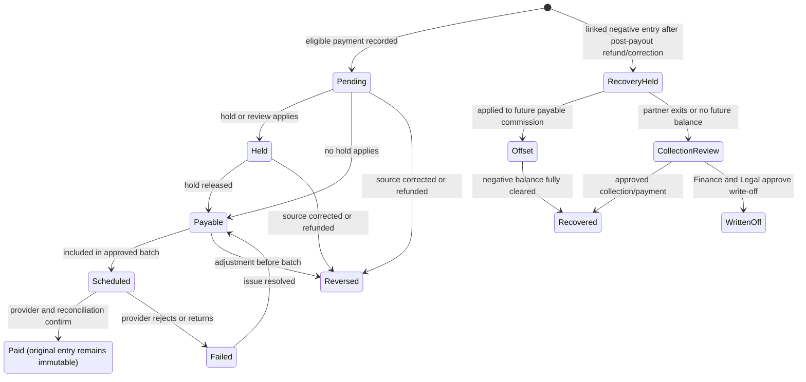
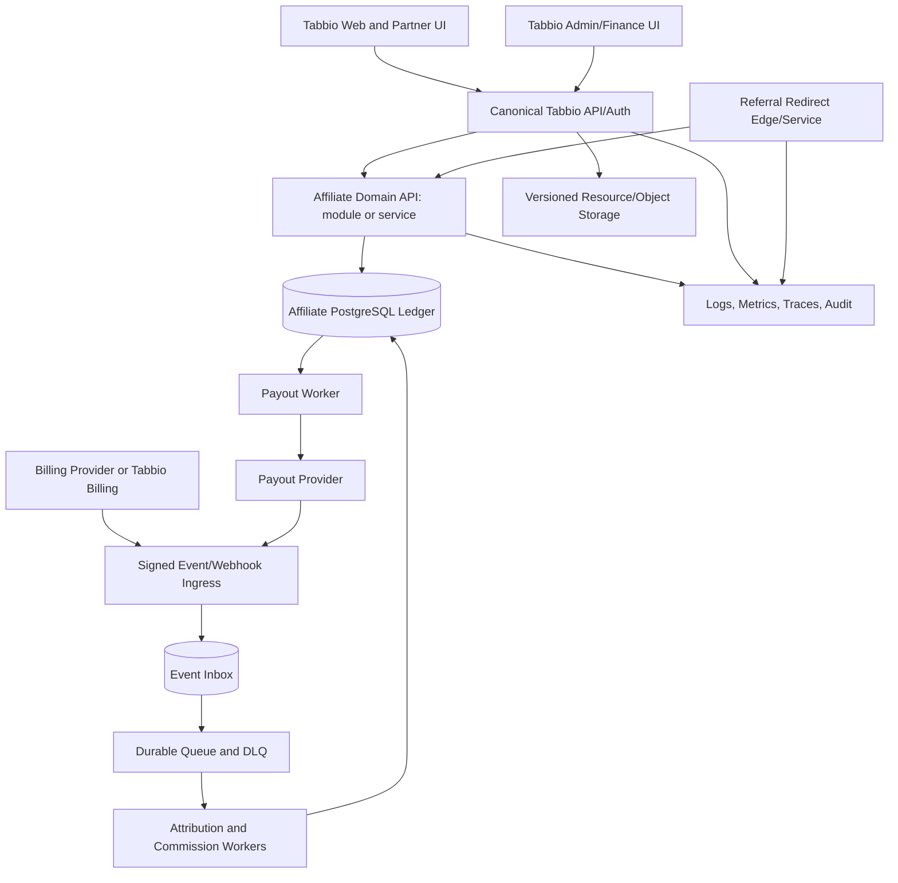

# PRD: Tabbio Partner Program

| Field             | Value                                                         |
| ----------------- | ------------------------------------------------------------- |
| Version           | 1.0                                                           |
| Status            | Frontend prototype in implementation; production system gated |
| Date              | 2026-08-09                                                    |
| Product           | Tabbio Partner                                                |
| Platform          | Responsive web inside the main Tabbio product                 |
| Product authority | `PRODUCT.md`                                                  |
| Design authority  | `DESIGN.md`                                                   |
| Builder authority | `CLAUDE.md`                                                   |

## 1. Decision summary

### Approved delivery slice: local frontend prototype

The user approved a frontend-only implementation in a real fork of RefRef. This slice has no authentication, server, database, attribution service, AI/LLM API, payout provider, email, or external analytics. It may use deterministic fixtures and `localStorage` for realistic local interactions. All such states must remain visibly labelled `Demo data`, `Local simulation`, `Not configured`, `Demo only`, or `Not connected`.

The implementation location is `apps/tabbio-partners` in `ahmedaldhraif/refref`, based on upstream commit `81af934fec3b20990a4d9af7ed472d0d14d73a82`. It uses the fork's actual `@refref/ui` source and does not import the authenticated webapp, tRPC, database, attribution scripts, workers, or provider adapters. The repository retains the upstream AGPL-3.0 license and history. This approval authorizes the local source prototype; it does not replace legal review before any network deployment.

The broader requirements below remain the production target and contract for later backend connection. Any acceptance criterion that depends on live identity, authorization, persistence, tracking, money movement, providers, privacy controls, or operations is deferred, not silently satisfied by fixture UI.

Build one Tabbio Partner program with four connected layers:

1. A public `/partners` page based on the supplied landing design.
2. Partner onboarding and eligibility inside the existing Tabbio identity.
3. A complete Partner area for useful work, links, attribution, earnings, resources, settings, and support.
4. An auditable affiliate engine for attribution, recurring commission, fraud review, adjustments, and payouts.

Use RefRef as a pinned, provenance-tracked referral-engine reference and selective scaffold. RefRef is not the product specification, accounting system, partner experience, or production security boundary. The audited upstream is alpha, its Affiliate template is marked `coming_soon`, and the runtime has material tenancy, money, security, and operations gaps.

Use Material Web `v2.5.0` as a pinned, Apache-2.0 component implementation reference. It can shorten stable control work if it fits the canonical Tabbio stack, but it is in maintenance mode and does not supply the navigation, data, visualization, or application compositions this product needs. M3 remains the behavior authority; Tabbio owns the integration and all missing components.

The preferred product shape is not a separate partner portal. A partner is a Tabbio user who earns. The main Tabbio shell exposes one `Partner` destination, then a shallow secondary navigation for Partner work.

## 2. Source authority

When two sources conflict, use this order:

| Priority | Authority                                                                | Owns                                                                      |
| -------: | ------------------------------------------------------------------------ | ------------------------------------------------------------------------- |
|        1 | User approvals and this PRD                                              | Product rules, scope, money, legal/provider gates                         |
|        2 | `PRODUCT.md`                                                             | Durable users, purpose, positioning, constraints                          |
|        3 | `DESIGN.md`                                                              | Tabbio visual system, M3 behavior, responsive and accessibility contracts |
|        4 | Canonical Tabbio target repository                                       | Existing auth, tenancy, billing, shell, tokens, conventions               |
|        5 | Current official M3 and Checklist Design guidance                        | Interaction behavior and UX coverage gates                                |
|        6 | Material Web `v2.5.0`, commit `b4de401eb665ec63474f39319a4ba8f2145974cc` | Optional component implementation source after compatibility approval     |
|        7 | Supplied SVG exports                                                     | Visual intent and content hierarchy only                                  |
|        8 | RefRef commit `81af934fec3b20990a4d9af7ed472d0d14d73a82`                 | Selective source mechanics after license approval                         |

These sources mostly own different domains: Material Web can supply implementation code but cannot override the SVG visual direction; the SVGs can supply visual intent but cannot override M3 behavior, accessibility, or product truth. No screenshot, sample number, seeded row, or README feature claim is product truth unless this PRD or a later approved decision records it.

## 3. Why this product exists

Typical affiliate systems stop at a generic link and a number. Tabbio has a stronger mechanism: partners can create and hand off real CV work, teach through useful content, share a tracked recommendation, and let clients or candidates claim a concrete Tabbio result. The system should make that work easy while making the money trail unusually clear.

### User outcomes

- A new partner understands the offer and eligibility without needing support.
- An eligible Tabbio user can become an active partner through one guided setup.
- A partner can create or copy a trackable link, share useful work, and see what happened.
- A partner can explain every commission status and payout amount.
- Operations can resolve an attribution, compliance, fraud, or payout case from one evidence trail.
- Finance can reconcile provider events, ledger entries, payout batches, and bank/provider results.

### Product success signals

Instrument these from launch, but set numeric targets only after a baseline exists:

- Landing-to-application conversion.
- Application completion and approval rates by lane and territory.
- Median time from approval to first useful share or client handoff.
- Partner activation rate within 7 and 30 days.
- Valid click-to-signup and signup-to-paying conversion by source.
- Attributed recurring revenue and commission as a percentage of eligible revenue.
- Payout success, reconciliation mismatch, reversal, dispute, and manual-adjustment rates.
- Partner support contacts per active partner and top unresolved reason.
- Percentage of commission entries automatically traceable without staff intervention.

## 4. Scope

### Version 1 includes

- Public partner landing page and earnings estimator.
- Existing-account sign-in plus new-account handoff to canonical Tabbio auth.
- Partner application, lane, agreement, jurisdiction checks, payout onboarding, review, approval, rejection, suspension, re-verification, leaving, and termination states.
- Partner Overview, Clients/CV Builder, Content Builder, Links, Earnings, Resources, Settings, notifications, and support entry.
- Main and tracked referral links, QR download, channels/campaigns, claim links, and public partner page preview.
- Click capture, first-party attribution, signup/claim association, recurring billing events, refunds, chargebacks, adjustments, and manual correction.
- Versioned commission rules and an immutable commission ledger.
- Payout accounts, holds, thresholds, batches, provider submission, failures, statements, and reconciliation.
- Admin/operations, finance, compliance, fraud-review, attribution-dispute, and audit surfaces.
- English and Arabic-ready architecture, WCAG 2.2 AA, M3 adaptive behavior, and Checklist Design coverage evidence.
- Production migrations, queue/outbox, observability, backup/restore, security hardening, rollback, and release gates.

### Explicit non-goals for Version 1

- Multi-level marketing or commissions on sub-affiliates.
- Public partner leaderboards or competitive gamification.
- Multi-user partner teams, invitations, seats, or shared agency workspaces. An agency enrolls one designated user account and must not share credentials; team support requires a later complete permissions and audit design.
- Tiered commission rates, coupon-code attribution, reseller invoicing, or white-label programs unless separately approved.
- Automatic posting to social networks or automatic public publishing of generated content.
- Automatic legal approval, permit approval, commission override, fraud guilt, or payout activation.
- A new authentication system separate from Tabbio.
- Copying RefRef marketing claims, mock data, seeded examples, or incomplete product shell.
- Dark mode unless the canonical Tabbio application already supports it accessibly.

## 5. Users, states, and permissions

### Roles

| Role                | Core permission                                                                                             |
| ------------------- | ----------------------------------------------------------------------------------------------------------- |
| Visitor             | Read the public program, estimate commission, begin application or sign in                                  |
| Applicant           | Complete and resume application, agreement, required promotion checks, and optional early payout onboarding |
| Partner             | Use approved Partner tools and inspect only their own attribution, earnings, and payout data                |
| Support/operations  | Review applications, partner cases, links, attribution evidence, and non-financial support actions          |
| Compliance reviewer | Review jurisdiction checks, documents, expiration, and program-rule compliance                              |
| Finance             | Review ledger, approve adjustments and payout batches, reconcile results, export statements                 |
| Program admin       | Configure effective-dated program rules and manage staff permissions                                        |
| Security auditor    | Read immutable security/audit evidence without ordinary mutation access                                     |

### Independent partner state axes

Do not model application approval, program membership, compliance eligibility, and payout capability as one status. They change for different reasons and have different effects.

| Axis                  | States                                                                                          | Product effect                                                                                                                            |
| --------------------- | ----------------------------------------------------------------------------------------------- | ----------------------------------------------------------------------------------------------------------------------------------------- |
| Application           | `draft`, `submitted`, `under_review`, `changes_requested`, `approved`, `rejected`, `withdrawn`  | Controls the review workflow. Approval is a decision, not the ongoing earning state.                                                      |
| Program membership    | `inactive`, `active`, `suspended`, `leaving`, `terminated`                                      | Controls Partner tools, link activity, and whether new eligible work can earn under the approved terms.                                   |
| Each compliance check | `not_started`, `submitted`, `under_review`, `verified`, `rejected`, `expired`, `not_applicable` | Promotion/territory checks may restrict links or new earning when Legal says they are prerequisites. Payout KYC is not a promotion check. |
| Payout capability     | `not_started`, `pending`, `ready`, `restricted`, `failed`, `disabled`                           | Controls payout scheduling/submission only. It never hides accrued earnings or blocks access to the Partner area by itself.               |

Recommended Version 1 rule: an approved application plus satisfied promotion-eligibility checks activates membership and allows earning. Payout setup may finish later; payable funds remain visible but unscheduled until capability is `ready`, threshold/cutoff rules pass, and Finance approves the batch. A payout restriction does not silently suspend membership or erase value. Every non-normal state includes a plain-language reason, allowed actions, effect on links, new earnings and payouts, recovery/support route, effective time, and audit evidence.

No screen may collapse `submitted`, compliance `verified`, application `approved`, membership `active`, and payout `ready` into one green check.

## 6. Commercial policy

The supplied design proposes the following policy. Treat it as the default product requirement, but do not enable real money until Finance and Legal approve the exact contract.

| Policy         | Proposed Version 1 value         | Required clarification                                                    |
| -------------- | -------------------------------- | ------------------------------------------------------------------------- |
| Commission     | 30% recurring                    | Define eligible net revenue and excluded products                         |
| Duration       | Customer's eligible lifetime     | Define effect of voluntary exit, suspension, and termination for cause    |
| Payout cadence | Monthly                          | Choose cutoff, approval date, submission date, weekend/holiday behavior   |
| Minimum payout | USD 50, shown as about AED 185   | Define per-currency threshold and FX source                               |
| Hold           | Design implies a holdback        | Define duration, percentage, release, and high-risk extension             |
| Base currency  | USD in supplied examples         | Confirm actual charge, ledger, statement, and payout currencies           |
| Provider       | Stripe Express shown in Settings | Confirm UAE platform eligibility and alternative provider/manual fallback |

### Recommended calculation contract

This is the build default unless Finance approves a replacement before Phase 2:

- A commission is created only from a settled eligible invoice or charge event, not from a signup or subscription-created event.
- At initial posting, `eligible_net_revenue` is the collected eligible line amount net of discounts, credits, and indirect tax represented on that settled source event. Do not retroactively reduce that historical base when a later refund arrives. A later refund, chargeback, or credit event creates exactly one linked immutable reversal. Payment-processor fees do not alter the partner base unless Finance explicitly changes the rule.
- Commission is computed with decimal arithmetic at higher precision and posted in integer minor units using half-even rounding at the ledger boundary.
- A refund, chargeback, credit note, or corrected source event creates a linked reversal entry. Financial history is never edited in place.
- Upgrades, downgrades, proration, trial conversion, multiple plans, partial refunds, and multi-currency invoices use actual settled line events.
- Once a customer attribution is locked, ordinary later clicks do not move it. An authorized correction creates a new effective attribution record and an audit event.
- `Lifetime` means each future eligible settled payment while the attribution and program terms remain valid. It is not a guarantee of income or a promise about a person's lifetime.

The design's `$14.99 -> $4.50` example is valid only if the entire USD 14.99 is eligible. The displayed `5% -> $0.22` holdback implies half-even rounding from USD 0.225. The final policy and examples must be generated from the same tested calculation library.

### Required money states



`Released` is an action that moves held value to Payable, not a second balance category. A paid commission entry never changes state. A post-payout refund or correction creates a linked negative recovery entry and negative partner balance. The Version 1 default is to offset future payable commission; never debit a partner's bank account automatically. Finance and Legal must approve collection or write-off when the partner exits or no future balance is expected. `Lifetime earned`, `Pending`, `Held`, `Payable`, `Scheduled`, `Paid`, and recovery balances must use one documented reconciliation equation.

## 7. End-to-end journey

```mermaid
flowchart LR
    A[Visitor opens /partners] --> B[Estimate and read terms]
    B --> C[Sign in or create Tabbio account]
    C --> D[Partner application]
    D --> E[Agreement and applicable checks]
    E --> F{Application approved and promotion-eligible?}
    F -- No --> G[Pending, changes requested, rejected, or restricted state]
    G --> E
    F -- Yes --> H[Active Partner area and earning]
    H --> I[Create CV/content or tracked link]
    I --> J[Recipient opens clean referral or claim link]
    J --> K[First-party attribution recorded]
    K --> L[Signup or claim accepted]
    L --> M[Eligible settled billing event]
    M --> N[Versioned commission calculation]
    N --> O[Pending or held ledger entry]
    O --> P[Payable balance]
    P --> T{Payout ready, threshold and cutoff met?}
    T -- No --> U[Keep visible and unscheduled; show recovery action]
    U --> T
    T -- Yes --> Q[Finance-approved payout batch]
    Q --> R[Payout provider]
    R --> S[Reconciled paid statement]
```



## 8. Information architecture

### Page hierarchy

```text
Tabbio
├── Public Partner page (/partners)
│   ├── Program terms (/partners/terms)
│   └── Referral redirect (/r/{code-or-slug})
├── Partner (/partner)
│   ├── Onboarding (/partner/onboarding)
│   ├── Overview (/partner)
│   ├── Clients (/partner/clients)
│   │   ├── New CV (/partner/clients/new)
│   │   └── CV detail (/partner/clients/{cvId})
│   ├── Create (/partner/create)
│   │   └── Draft detail (/partner/create/{draftId})
│   ├── Links (/partner/links)
│   │   └── Link detail (/partner/links/{linkId})
│   ├── Earnings (/partner/earnings)
│   │   ├── Payouts (/partner/earnings/payouts)
│   │   └── Payout detail (/partner/earnings/payouts/{payoutId})
│   ├── Resources (/partner/resources)
│   └── Settings (/partner/settings)
│       ├── Program checks (/partner/settings/checks)
│       └── Payout account (/partner/settings/payout)
└── Admin (/admin/partners)
    ├── Applications (/admin/partners/applications)
    ├── Partner detail (/admin/partners/{partnerId})
    ├── Attribution (/admin/partners/attribution)
    ├── Commissions (/admin/partners/commissions)
    ├── Payouts (/admin/partners/payouts)
    ├── Reviews (/admin/partners/reviews)
    ├── Rules (/admin/partners/rules)
    └── Audit (/admin/partners/audit)
```

### Navigation specification

- The main Tabbio navigation gets one item: `Partner`.
- Partner secondary navigation order: Overview, Clients, Create, Links, Earnings, Resources, Settings.
- The canonical Tabbio shell owns exactly one persistent navigation component at each viewport. Do not add a Partner bar below an app bar or a Partner rail beside an app rail.
- On compact screens, keep the shell's flexible navigation and expose Partner-local sections through one labelled page-level section control or an accessible tabs-plus-More pattern. Overview, Create, Links, and Earnings are the first local choices; More exposes Clients, Resources, and Settings.
- On medium and larger screens, Partner destinations may nest within the shell's existing collapsed/expanded rail only if that shell supports grouped destinations. Otherwise use a content-header section control. Do not introduce a legacy drawer or competing second rail.
- Admin is not visible to ordinary partners. Staff reach it through the existing role-gated admin area.
- Detail routes use a back link and breadcrumb where the surrounding Tabbio shell supports breadcrumbs.
- No page is orphaned and every important partner task is reachable within two actions from `/partner`.

### URL map

| Page                | URL                   | Primary action        | Access                                     |
| ------------------- | --------------------- | --------------------- | ------------------------------------------ |
| Public partner page | `/partners`           | Become a partner      | Public                                     |
| Partner onboarding  | `/partner/onboarding` | Continue setup        | Applicant                                  |
| Partner overview    | `/partner`            | Complete next task    | Active partner                             |
| Clients             | `/partner/clients`    | Create CV             | Active partner                             |
| Content builder     | `/partner/create`     | Create draft          | Active partner                             |
| Links               | `/partner/links`      | Create tracked link   | Active partner                             |
| Earnings            | `/partner/earnings`   | View ledger/payout    | Active member, including payout-restricted |
| Resources           | `/partner/resources`  | Download/use resource | Active member                              |
| Settings            | `/partner/settings`   | Save profile/settings | Applicant or active member                 |
| Partner admin       | `/admin/partners`     | Review work queue     | Authorized staff                           |

## 9. Functional requirements

### Identity, application, and onboarding

| ID     | Requirement                                                                                                                                                                                                                      | Priority |
| ------ | -------------------------------------------------------------------------------------------------------------------------------------------------------------------------------------------------------------------------------- | -------: |
| ID-01  | Use canonical Tabbio identity and session. Do not create a second password or account database.                                                                                                                                  |       P0 |
| ID-02  | Map Partner, Support/Operations, Compliance, Finance, Program Admin, and Security Auditor permissions explicitly. A Partner can access only their own partner data; staff powers are least-privilege and independently testable. |       P0 |
| ONB-01 | Application captures lane, public name, audience, territory/residency, promotion channels, experience, and required declarations.                                                                                                |       P0 |
| ONB-02 | A 3 to 5 step guided flow shows progress, saves resume state, validates clearly, and ends with one next action.                                                                                                                  |       P0 |
| ONB-03 | Store exact agreement version, locale, rendered hash, acceptance time, actor, IP-risk evidence if approved, and later supersession.                                                                                              |       P0 |
| ONB-04 | Compliance checks are conditional by jurisdiction and activity. States are not_started, submitted, under_review, verified, rejected, expired, and not_applicable.                                                                |       P0 |
| ONB-05 | External provider checks show real provider state. Never infer verification from a redirect or submitted form.                                                                                                                   |       P0 |
| ONB-06 | Rejection, changes requested, suspension, and termination each provide reason, appeal/support route, effect on links, earnings, and payouts.                                                                                     |       P0 |
| ONB-07 | Provide re-verification before an expiring document/check disables earning or payout.                                                                                                                                            |       P1 |

### Referral links and attribution

| ID      | Requirement                                                                                                                                                           | Priority |
| ------- | --------------------------------------------------------------------------------------------------------------------------------------------------------------------- | -------: |
| ATTR-01 | Generate an opaque globally unique main refcode and an optional product-scoped vanity slug.                                                                           |       P0 |
| ATTR-02 | A tracked link records channel, campaign, optional sub-ID, approved destination, creator, state, and creation time.                                                   |       P0 |
| ATTR-03 | Redirect only to allowlisted Tabbio destinations, rate limit abuse, record click evidence, and never place name/email or other PII in the query string.               |       P0 |
| ATTR-04 | Use a signed first-party attribution token/cookie. Retention, consent classification, and clean-URL behavior are configurable and legally approved.                   |       P0 |
| ATTR-05 | At the tracked-click tier, use the last eligible partner click within 90 days before accepted customer association. Lock the winning attribution on that association. |       P0 |
| ATTR-06 | Cross-device association occurs through authenticated signup, claim link, or explicit code. Do not use covert fingerprinting.                                         |       P0 |
| ATTR-07 | Reject or hold self-referral, staff/test accounts, duplicate customer identity, disallowed destinations, and known abusive traffic.                                   |       P0 |
| ATTR-08 | Manual attribution correction requires evidence, reason, permission, previewed money impact, reversal/replacement entries, and audit record.                          |       P0 |
| ATTR-09 | Partners can create, copy, edit labels/destination within policy, archive, and download a QR code. Codes cannot silently point to a new unapproved domain.            |       P1 |
| ATTR-10 | Claim links bind a Tabbio artifact and recipient flow without exposing client PII. Acceptance and ownership transfer are explicit and auditable.                      |       P1 |
| ATTR-11 | Implement the approved precedence matrix below with effective-time evidence and deterministic same-tier tie-breaking. No code path may invent a different precedence. |       P0 |

#### Attribution precedence and edge cases

An existing locked attribution is not replaced by a later click, claim, or code. Only an authorized audited correction can supersede it. When no attribution is locked, use the first applicable tier below:

| Priority | Eligible evidence                                                                                              | Rule                                                                                                                                                                            |
| -------: | -------------------------------------------------------------------------------------------------------------- | ------------------------------------------------------------------------------------------------------------------------------------------------------------------------------- |
|        1 | Accepted signed claim tied to a specific Tabbio artifact and intended recipient                                | Wins because the recipient explicitly accepted a concrete partner handoff. It must pass token, ownership, expiry, single-use, self-referral, and customer-eligibility checks.   |
|        2 | Partner code explicitly entered and confirmed by the customer during authenticated signup or eligible checkout | Wins over a passive cookie when the code is valid for the same program/product and the customer is eligible. Store the confirmation evidence.                                   |
|        3 | Signed tracked-click evidence                                                                                  | Use the most recent eligible click within the approved window for the same program/product. Ignore expired, tampered, self-referral, disallowed, bot, staff, and test evidence. |

Same-tier events use the latest eligible event time, then the stable event ID as a deterministic tie-break. Record considered evidence and the rejection reason for higher-priority or later evidence that did not qualify.

| Edge case                                     | Version 1 default                                                                                                                                            |
| --------------------------------------------- | ------------------------------------------------------------------------------------------------------------------------------------------------------------ |
| Existing active or previously paying customer | Do not create a new attribution unless an approved migration or reactivation rule explicitly allows it. Never grant retroactive commission from a new click. |
| Reactivated customer                          | Retain the prior locked attribution when the program and customer identity remain valid; otherwise route to review rather than silently reassign.            |
| Customer/account merge                        | The canonical customer's earliest still-valid locked attribution wins. Hold conflicts for reviewed correction; never combine two partners' claims.           |
| Cross-product evidence                        | Evidence is program/product scoped. It applies across products only when an effective program rule explicitly says so.                                       |
| Cross-device journey                          | Associate only through authenticated signup, accepted claim, or explicit code. Do not fingerprint.                                                           |
| Manual correction                             | Requires privileged evidence, effective time, reason, impacted-money preview, compensating entries, and audit. It is not a normal precedence tier.           |

### Billing events and commission ledger

| ID     | Requirement                                                                                                                                                                                                                                                                  | Priority |
| ------ | ---------------------------------------------------------------------------------------------------------------------------------------------------------------------------------------------------------------------------------------------------------------------------- | -------: |
| COM-01 | Ingest signed billing events through an event inbox with unique provider/account/event ID and payload hash. Duplicate delivery produces no duplicate outcome.                                                                                                                |       P0 |
| COM-02 | Normalize provider events into versioned domain events: payment_settled, payment_refunded, dispute_opened/won/lost, credit_applied, subscription_changed, and customer_merged.                                                                                               |       P0 |
| COM-03 | Process asynchronously through transactional outbox, durable queue, retry policy, dead-letter queue, and replay tooling.                                                                                                                                                     |       P0 |
| COM-04 | Every calculation stores source event, attribution, rule version, eligible base, rate, precision, rounding, currency, amount, status, and explanation.                                                                                                                       |       P0 |
| COM-05 | Ledger entries are immutable. Corrections create linked reversals and replacements.                                                                                                                                                                                          |       P0 |
| COM-06 | Enforce idempotency and uniqueness in the database, not only in application checks.                                                                                                                                                                                          |       P0 |
| COM-07 | Support refunds, partial refunds, chargebacks, credit notes, proration, upgrade, downgrade, cancellation, reactivation, multiple eligible items, and multi-currency.                                                                                                         |       P0 |
| COM-08 | Rules are effective-dated and versioned. A new rule never changes historical calculations.                                                                                                                                                                                   |       P0 |
| COM-09 | Financial records use integer minor units plus ISO currency, with a documented higher-precision calculation layer. Never use floating-point money.                                                                                                                           |       P0 |
| COM-10 | Daily reconciliation compares billing source, accepted domain events, ledger totals, payout eligibility, and exceptions.                                                                                                                                                     |       P0 |
| COM-11 | A post-payout refund or correction leaves the paid entry unchanged and creates one linked negative recovery entry. Support future offset, negative balance, partner exit, collection review, approved write-off, statement, and audit behavior without automatic bank debit. |       P0 |

### Payouts

| ID     | Requirement                                                                                                                    | Priority |
| ------ | ------------------------------------------------------------------------------------------------------------------------------ | -------: |
| PAY-01 | Abstract payout provider behind an internal contract. Stripe Connect is one adapter, not hard-coded domain logic.              |       P0 |
| PAY-02 | Onboarding stores provider account ID and state, not bank details. Sensitive provider data stays with the provider.            |       P0 |
| PAY-03 | Changing payout destination, tax details, email, password, or 2FA requires step-up authentication and audit.                   |       P0 |
| PAY-04 | Generate deterministic payout batches by cutoff, threshold, currency, eligible partner, and approved hold state.               |       P0 |
| PAY-05 | Finance previews, approves, submits, and reconciles a batch with maker/checker separation. No automatic live payout at launch. |       P0 |
| PAY-06 | Provider webhooks and reconciliation confirm paid, failed, returned, or canceled. Submission alone is not `Paid`.              |       P0 |
| PAY-07 | Partners can inspect payout items, fees/FX if any, statement, failure reason, expected next step, and support path.            |       P1 |
| PAY-08 | A failed or returned payout returns eligible items safely to a resolvable state without duplication.                           |       P0 |

### Partner workspace and Tabbio-native tools

| ID     | Requirement                                                                                                                                                                             | Priority |
| ------ | --------------------------------------------------------------------------------------------------------------------------------------------------------------------------------------- | -------: |
| UI-01  | Overview uses one coherent period and dataset for clicks, signups, paying customers, earning balances, chart, and recent activity.                                                      |       P0 |
| UI-02  | The next-task surface selects the highest-value incomplete action and explains why it matters.                                                                                          |       P1 |
| CV-01  | Clients supports create, edit, style selection, status, preview, claim link, accepted claim, archive, search, filter, and accessible compact representation.                            |       P1 |
| CV-02  | Client identity and artifact permissions follow the canonical Tabbio CV model. Do not duplicate or expose private CV data through the affiliate engine.                                 |       P0 |
| CNT-01 | Content Builder supports Script, Post, and Article, prompt/brief, optional settings, generated draft, editing, disclosure insertion, save/history, copy/export, and error/limit states. |       P1 |
| CNT-02 | Generated content never publishes automatically. Claims and disclosures remain the partner's responsibility and can be reviewed against approved copy.                                  |       P0 |
| LNK-01 | Links provides main link, tracked links, QR, create/edit/archive, metrics, source/campaign filters, and detail.                                                                         |       P0 |
| ERN-01 | Earnings defines every balance and exposes ledger detail, filters, payout history, statements, disputes, and support.                                                                   |       P0 |
| RES-01 | Resources stores versioned brand assets, type guide, writing/playbook files, approved claim copy, partner disclosure, promotion rules, and file checksum/version.                       |       P1 |
| SET-01 | Settings covers public profile, lane, language, notifications, public-page preview, agreement, checks, payout account, security handoff, and leave/deactivate.                          |       P1 |

### Admin, fraud, and support

| ID     | Requirement                                                                                                                                                                                                                       | Priority |
| ------ | --------------------------------------------------------------------------------------------------------------------------------------------------------------------------------------------------------------------------------- | -------: |
| OPS-01 | Work queues cover applications, expiring checks, attribution disputes, fraud reviews, failed events, ledger exceptions, and payout failures.                                                                                      |       P0 |
| OPS-02 | Fraud signals include self-referral, identity/payment overlap, click spam, impossible conversion, repeated refunds/chargebacks, disallowed brand bidding evidence, and provider risk. Signals create review, not automatic guilt. |       P0 |
| OPS-03 | Staff actions require least privilege. Financial override and payout approval require Finance permission and maker/checker controls.                                                                                              |       P0 |
| OPS-04 | Audit records actor, role, tenant, action, subject, reason, before/after reference, request/correlation ID, and timestamp. Audit records are append-only.                                                                         |       P0 |
| OPS-05 | Support can see a redacted timeline and create a case without seeing secrets or full bank/tax data.                                                                                                                               |       P1 |
| OPS-06 | Program rules can be drafted, reviewed, scheduled, activated, and retired with an impact preview.                                                                                                                                 |       P1 |
| OPS-07 | Add emergency controls for redirect disable, event-ingestion pause, commission hold, and payout pause. Each control is permissioned and audited.                                                                                  |       P0 |

## 10. Metric definitions

The supplied exports contain contradictory totals. Implementation must generate every number from a shared metrics layer.

| Metric             | Definition                                                                                                                                              |
| ------------------ | ------------------------------------------------------------------------------------------------------------------------------------------------------- |
| Total clicks       | Valid redirect events in the selected period after bot/rate-limit policy, including repeats                                                             |
| Unique visitors    | Privacy-approved deduplicated visitor sessions in the selected period, never device fingerprint count                                                   |
| Attributed signups | Distinct Tabbio accounts whose accepted attribution was created in the selected period                                                                  |
| Paying customers   | Distinct attributed customers with at least one eligible settled payment under the selected scope                                                       |
| Click-to-signup    | Attributed signups divided by valid clicks for the same link/campaign, period, and attribution model                                                    |
| Signup-to-paying   | Paying customers divided by attributed signups for the same cohort and scope                                                                            |
| Pending            | Posted commission not yet held/released to payable according to rule                                                                                    |
| Held               | Posted commission explicitly delayed for time or review                                                                                                 |
| Payable            | Released commission eligible for a future batch and not yet scheduled                                                                                   |
| Scheduled          | Commission assigned to an approved payout batch                                                                                                         |
| Paid               | Provider-confirmed and reconciled payout items                                                                                                          |
| Recovery balance   | Outstanding linked negative post-payout entries not yet offset, recovered, or written off through an approved decision                                  |
| Lifetime earned    | Approved accounting sum of positive accrual, pre-payout reversals, and post-payout recovery entries according to the documented reconciliation equation |

Every page shows period, timezone, currency, filters, last refresh, and whether data is delayed. Link rows can never show more converted customers than valid clicks under the same scope.

## 11. Open-source reuse plan

### 11.1 RefRef backend and domain source

Audit baseline: [`81af934`](https://github.com/amicalhq/refref/tree/81af934fec3b20990a4d9af7ed472d0d14d73a82), 2026-03-20.

#### Mandatory license gate

RefRef is [AGPL-3.0](https://github.com/amicalhq/refref/blob/81af934fec3b20990a4d9af7ed472d0d14d73a82/LICENSE). Before copying code, Legal and Engineering must choose and record one route:

1. Operate an AGPL-compliant fork and provide corresponding source as required.
2. Obtain a commercial/dual license from the maintainers.
3. Clean-room reimplement the approved concepts and contracts without copying AGPL code.

The required technical boundary is a provenance-tracked affiliate domain communicating through explicit contracts. Gate 0 decides whether it deploys inside the canonical Tabbio backend or as a service. Service separation does not by itself settle AGPL obligations.

#### Reuse matrix

| RefRef area                              | Decision                              | Tabbio action                                                                                                                                                                 |
| ---------------------------------------- | ------------------------------------- | ----------------------------------------------------------------------------------------------------------------------------------------------------------------------------- |
| pnpm/Turbo service/package split         | Reuse only if it fits the target repo | Preserve existing Tabbio build conventions first                                                                                                                              |
| `packages/coredb/src/schema.ts`          | Concept seed                          | Retain program, participant, refcode/reflink, event, rule, reward concepts; rebuild tenant keys, financial retention, constraints, ledger, payouts, and migrations            |
| `apps/api/src/routes/v1/track/*`         | Adapt                                 | Keep typed validation/API-key pattern; bind identity to tenant, add signed events, database idempotency, transaction/outbox, currency, and provider adapters                  |
| `apps/api/src/services/reward-engine.ts` | Concept seed                          | Reuse fixed/percent rule matching only after resolving config mismatch; replace fire-and-forget execution and reward row with durable versioned ledger processing             |
| `apps/refer/src/routes/r.ts`             | Adapt heavily                         | Keep vanity/global code lookup and rate limiting; remove base64 PII in query parameters, add safe destinations, click evidence, signed state, privacy, and distributed limits |
| `packages/attribution-script`            | Concept seed                          | Keep URL capture and configurable retention; add consent policy, signed values, SPA navigation support, CSP/SRI, clean URL, and server association                            |
| Better Auth/org scaffold                 | Integrate or replace                  | Prefer canonical Tabbio auth; use explicit RBAC and tenant repository guards if any RefRef auth code remains                                                                  |
| RefRef webapp tables/forms               | Selective UI reuse                    | Reuse accessible headless mechanics only; rebuild Tabbio shell, Partner experience, complete states, and M3 behavior                                                          |
| Widget                                   | Optional later                        | Current widget is sharing UI, not a partner portal; use only if a real embedded Tabbio use case is approved                                                                   |
| Tests                                    | Extend, do not trust as gate          | Reuse unit patterns; add real DB, tenant, migration, E2E, payout, failure, and contract tests                                                                                 |
| Docker Compose                           | Local reference only                  | Build complete controlled topology; never run production with default credentials, `db:push`, or auto-seed                                                                    |

#### Verified upstream blockers

- The README labels RefRef alpha, and the Affiliate template is `coming_soon`.
- API routes accept caller-supplied product/program identifiers without complete tenant binding.
- Purchase attribution can query referral identity outside product/program scope.
- Ordinary organization membership is too broad for sensitive program/reward mutation.
- Product secrets can be returned in plaintext.
- Redirects encode name/email in query parameters with base64, which is not privacy protection.
- Purchase idempotency is not database-enforced; referral `onConflictDoNothing()` has no matching unique constraint.
- Reward processing is fire-and-forget and comments that production needs a queue.
- Reward currency is hard-coded USD, while percentage configuration and engine units disagree.
- There is no immutable recurring commission ledger, payout provider, payout reconciliation, tax/KYC flow, real partner portal, fraud operations, or complete webhook lifecycle.
- Docker Compose starts only PostgreSQL and the webapp, with development defaults and schema push/seed behavior.
- A 2026-08-08 `pnpm audit --prod` snapshot against the pinned lockfile reported 95 production vulnerability occurrences: 4 critical, 53 high, 27 moderate, and 11 low. Re-run at implementation time and block release on unresolved critical/high findings unless a written security exception exists.

Do not claim the upstream's 83 passing unit tests prove readiness. Its default CI omits E2E, lint, migration, container, and dependency-audit gates, and important suites use mocked database calls.

### 11.2 Material Web UI implementation source

Audit baseline: [`v2.5.0` at `b4de401`](https://github.com/material-components/material-web/tree/b4de401eb665ec63474f39319a4ba8f2145974cc), released in July 2026.

Material Web uses Apache-2.0 and is materially easier to integrate into proprietary software than RefRef's AGPL source, but it still requires license/provenance handling. Its README and roadmap say maintenance mode pending maintainers, no planned new features/components, and case-by-case bug fixes or contributions. Tabbio must own upgrades and replacements if it adopts the package.

Before adoption, Engineering must compare four paths in the actual Tabbio repository:

1. Keep canonical Tabbio components and use only M3 behavior/docs.
2. Wrap selected `@material/web` stable components behind Tabbio APIs.
3. Port specific Apache-licensed behavior, tokens, or tests with provenance.
4. Adopt a broader Material Web layer only if the measured integration and maintenance cost is lower.

The spike must cover framework bindings, server rendering/hydration if applicable, bundle cost from individual imports, CSS token mapping, forms and autofill, event typing, browser support, focus/keyboard behavior, screen readers, 200% zoom, touch targets, dark/high-contrast behavior if supported by Tabbio, Arabic/RTL, test tooling, and removal/replacement cost. The pinned upstream documents Chrome/Edge 120+, Firefox 119+, and Safari 16.4+ and may need an `ElementInternals` polyfill on older Safari; Tabbio must compare that floor to its actual browser contract.

| Material Web area                                                                                                   | Decision                                                                                                                         |
| ------------------------------------------------------------------------------------------------------------------- | -------------------------------------------------------------------------------------------------------------------------------- |
| Stable buttons, icon buttons, checkbox, radio, switch                                                               | Strong reuse/wrap candidates after the spike                                                                                     |
| Stable text field, select, slider                                                                                   | Candidates only after forms, validation, mobile input, and RTL verification                                                      |
| Stable dialog, menu, list, tabs, chips, progress, focus ring                                                        | Selective behavior/code candidates with full exceptional-state tests                                                             |
| Tokens, typography, color, Sass helpers                                                                             | Reference or map into Tabbio semantic tokens; do not let raw Material tokens become product semantics                            |
| `labs/*` expressive controls, card, badge, utility classes                                                          | Reference only; do not ship as a production runtime dependency because upstream marks labs experimental and not production-ready |
| Navigation bar/rail, data table, chart, search, snackbar, tooltip, date/time picker, autocomplete, segmented button | Missing from the stable pinned component set; implement with Tabbio primitives and the M3/Checklist/WCAG contracts               |

Do not import the all-components bundle in production, adopt the README's Roboto example as Tabbio typography, assume Web Components integrate cleanly with the unknown target framework, or wait for the maintenance-mode roadmap to fill gaps. If Material Web text fields are adopted, account for the pinned documentation's lack of `aria-labelledby` support and verify their internal label, descriptions, errors, and announcements. Pin direct runtime dependencies, preserve Apache-2.0 notices and modification provenance, scan the resulting dependency tree, and maintain visual regression plus accessibility tests around every wrapper.

## 12. Target logical architecture

This diagram fixes domain responsibilities, durability, and data flow, not the physical deployment. Gate 0 decides whether the affiliate domain runs as a module in the canonical Tabbio backend, a separately deployed service, or a legally approved RefRef-derived service. The same authorization, idempotency, ledger, privacy, and operational boundaries apply in every option.



### Boundaries

- Tabbio owns user identity, primary account/workspace, CV/content permissions, customer identity, product catalog, and source billing facts.
- The affiliate domain owns program membership, referral links/clicks, attribution, commission rules, ledger, payout orchestration, fraud cases, and program audit. Its physical module/service boundary is a Gate 0 decision.
- Provider adapters translate billing and payout events into internal contracts. No provider-specific object becomes the core domain model.
- Use transactional outbox/inbox for cross-service consistency. Do not use a distributed transaction.
- Keep public redirect hot path small, allowlisted, region-aware, and independent from slow dashboard queries.

## 13. Data model

Names may adapt to the target repository, but these responsibilities and constraints are required.

| Entity                    | Purpose                                | Critical constraint                                                                                         |
| ------------------------- | -------------------------------------- | ----------------------------------------------------------------------------------------------------------- |
| `affiliate_program`       | Program identity and status            | Tenant/product scoped; no hard delete after financial activity                                              |
| `commission_rule_version` | Effective-dated rate/base/hold policy  | Immutable after activation                                                                                  |
| `partner_profile`         | Tabbio user-to-program membership      | Unique tenant/program/user; independent membership state                                                    |
| `partner_application`     | Submitted application and review       | Versioned answers and decision evidence                                                                     |
| `agreement_acceptance`    | Terms/disclosure acceptance            | Agreement hash/version/locale/actor/time                                                                    |
| `compliance_check`        | Conditional permit/KYC/program checks  | Type, jurisdiction, provider/source, expiry, reviewer                                                       |
| `referral_code`           | Opaque main code                       | Globally unique and non-PII                                                                                 |
| `referral_link`           | Vanity/tracked link                    | Product/program scope, allowlisted destination, campaign/source                                             |
| `referral_click`          | Valid click evidence                   | Retention-limited, privacy-approved, link/program scope                                                     |
| `attribution`             | Customer-to-partner association        | One effective attribution per customer/program; effective history                                           |
| `claim`                   | Artifact/recipient claim flow          | Signed token, expiry, single-use/explicit acceptance                                                        |
| `event_inbox`             | Raw external event receipt             | Unique provider/account/event ID and payload hash                                                           |
| `commerce_event`          | Normalized billing fact                | Unique source event, schema version, customer/product scope                                                 |
| `commission_entry`        | Immutable money movement               | Accrual/reversal/recovery type, source, rule, attribution, amount/currency, and links to the original entry |
| `payout_account`          | Independent payout-capability state    | Provider token/ID only; step-up for change; never doubles as membership/compliance state                    |
| `payout_batch`            | Finance-approved settlement group      | Immutable cutoff/rule snapshot and maker/checker                                                            |
| `payout_item`             | Partner settlement and provider result | Unique commission allocation; reconciliation state                                                          |
| `fraud_signal`            | Machine or provider signal             | Evidence and severity, not final guilt                                                                      |
| `review_case`             | Human review/dispute                   | Owner, reason, evidence, decision, appeal/support                                                           |
| `audit_event`             | Append-only privileged action record   | Tenant, actor, role, request, subject, reason, timestamp                                                    |

### Database rules

- Put tenant/workspace, product, and program ownership on every applicable row and enforce matching ownership with composite constraints or equivalent guarded repositories.
- Add negative tenant-isolation tests for every query and mutation. PostgreSQL RLS is recommended as defense in depth where operationally supported.
- Use unique constraints for external event IDs, provider payout IDs, effective attribution, referral code/slug scope, agreement acceptance, and commission allocation.
- Do not cascade-delete financial, agreement, compliance, or audit history. Use retention-aware anonymization and legal holds.
- Encrypt sensitive fields at rest with managed key rotation. Hash only where equality lookup is required and raw recovery is not.
- Redact PII, tokens, secrets, document content, bank/tax data, and full attribution identifiers from ordinary logs.

## 14. API and event contracts

### Public endpoints

- `GET /r/{code}` and `GET /r/{product}/{slug}`: validate, rate limit, record permitted click evidence, set/forward signed opaque attribution, and redirect to an allowlisted destination.
- `GET /partners`: public program configuration and plan-estimator inputs through cacheable read model. Do not expose private rule internals or staff data.
- Claim routes use short-lived, signed, purpose-bound, revocable tokens and an explicit recipient confirmation.

### Authenticated partner endpoints

- Read own profile/lifecycle/checks, metrics, links, ledger, payouts, resources, notifications, and support cases.
- Create/update tracked links within destination policy.
- Create Tabbio-native CV/content/claim artifacts through canonical Tabbio services, not affiliate storage.
- Initiate payout-provider onboarding and receive real state.
- Any mutation has authorization, validation, idempotency where repeatable, audit, and stable error codes.

### Internal and admin endpoints

- Billing event ingestion requires signature verification, replay protection, idempotency, schema version, and tenant/provider binding.
- Admin mutations require explicit permission plus reason. Money-affecting changes return an impact preview before commit.
- Payout batch creation, approval, submission, cancel, retry, and reconciliation use separate permissions.
- Publish an OpenAPI or equivalent machine contract and test it against runtime routes. RefRef's current OpenAPI files are not reliable authority.

### Event envelope

Every internal event includes:

```json
{
  "event_id": "stable-unique-id",
  "event_type": "payment.settled.v1",
  "occurred_at": "ISO-8601",
  "received_at": "ISO-8601",
  "tenant_id": "...",
  "product_id": "...",
  "subject_id": "...",
  "source": "provider-or-service",
  "source_event_id": "...",
  "correlation_id": "...",
  "schema_version": 1,
  "payload": {}
}
```

Consumers are idempotent by `event_id` and source identity. Schema evolution is backward compatible or versioned.

## 15. Screen acceptance

### Public partner page

- Offer, eligibility, 30% recurring definition, payout cadence/threshold, and estimator assumptions are visible and consistent with active program configuration.
- Calculator uses live plan data, paired numeric inputs, keyboard-accessible sliders, locale currency, and `Estimated commission` language.
- `Under ten minutes` or `one session` is removed unless measured and scoped to tasks under Tabbio's control. External permit/provider review is never included in a speed promise.
- Show three useful-work paths: client CV work, creator/education content, and agency/candidate handoff.
- FAQ answers attribution, payout, refund/reversal, advertiser permit, leaving/removal, privacy, agreement, support, and CV style.
- Program terms, privacy, disclosure guidance, accessibility, and contact are linked.

### Application, membership, compliance, and payout setup

- Show the four state axes independently and explain what each controls.
- An approved, promotion-eligible applicant can enter the active Partner area and earn while payout setup is pending.
- Payout restriction keeps accrued and payable money visible, blocks only scheduling/submission, and provides the real recovery action.
- Compliance expiry affects only the behavior Legal mapped to that check; it never silently changes unrelated membership or payout state.
- Every transition shows actor/source, effective time, reason, next action, support/appeal path, and audit evidence where the viewer is authorized.

### Overview

- Focal balance reconciles with Earnings for the same currency/scope.
- Clicks, attributed signups, paying customers, and next payout state name their period and definition.
- Next task is actionable.
- Chart has a text summary and data alternative.
- Activity shows source, customer-safe description, amount, currency, state, date, and detail action.

### Clients/CV Builder

- Add the missing Create CV action.
- Status vocabulary is defined: Draft, Sent, Viewed, Claim pending, Claimed, Expired, Archived, or canonical Tabbio equivalents.
- Status never depends on a green/amber dot.
- Claim handoff protects client data and clearly transfers only approved ownership/access.

### Content Builder

- Add result, editor, saved drafts/history, disclosure insertion, limits, failure, and export/copy states.
- Correct the example to `Show fresh graduates how to turn a PDF CV into one live link.`
- More Options contains real controls or is removed.
- Generated claims are checked against current approved claims, but the partner remains responsible for review and publication.

### Links

- Add Create tracked link, source/channel/campaign/destination, archive, and link detail.
- QR is tied to the same immutable link target and can be regenerated.
- Metrics use the shared definitions and can never produce impossible rows such as 76 customers from 34 clicks.

### Earnings and payouts

- Replace the impossible supplied example where Paid exceeds Lifetime earned under the label shown.
- Show Pending, Held, Payable, Scheduled, Paid, pre-payout Reversed, and post-payout Recovery balance with definitions. Paid history remains paid.
- Payout detail shows included entries, provider reference, dates, FX/fees, statement, and failure/support route.
- No amount displays `Paid` before provider confirmation and reconciliation.

### Resources and Settings

- Replace duplicated disclosure copy with legally approved partner disclosure.
- Give each promotion rule its own explanation. Correct `Keep surfaces quiet`.
- Download actions point to versioned real files and expose type, size, version/date, and checksum where useful.
- Settings adds real notification controls and public-page preview.
- Advertiser permit, agreement, and payout provider show separate, honest states and expiry/review information.
- Use one coherent example identity in demo fixtures.

### Admin

- List-detail inspection, saved filters, export where authorized, and stable deep links.
- Every high-risk action shows consequence, requires reason, uses appropriate step-up/maker-checker, and records audit.
- Staff can replay failed events without producing duplicate money.
- Data export is permissioned, minimized, watermarked/logged where appropriate, and never exposes secrets.

## 16. Material 3 and Checklist Design quality contract

Use this sentence in implementation reviews:

> M3 defines interaction behavior; Checklist Design verifies UX coverage; WCAG and ASVS determine accessibility and security release readiness.

### M3 requirements

- Window classes: compact `<600`, medium `600-839`, expanded `840-1199`, large `1200-1599`, extra large `1600+`.
- Use one pane on compact/medium by default, list-detail or supporting pane on larger widths when it has a real task.
- The canonical shell chooses one flexible bar or collapsed/expanded rail for the viewport. Partner-local navigation nests in that same shell component when supported or uses one content-level section control. Never show competing bars/rails.
- Current M3 no longer recommends the legacy navigation drawer as the primary desktop pattern.
- Fields have visible labels, supporting/error text, programmatic association, and no placeholder-only labels.
- Prefer one high-emphasis action per page with specific sentence-case verb.
- Specify enabled, disabled, hover, focus, pressed, selected, loading, success, error, empty, no-results, permission, and overflow states as applicable.
- Snackbars are non-blocking and never the only durable confirmation. Dialogs are reserved for critical decisions and restore focus.
- Under 200ms needs no indicator, 200ms to 5s uses a loading indicator, and longer work uses labelled progress.
- Semantic HTML, landmarks, DOM/focus order, keyboard flow, contrast, touch targets, 200% text resizing, and live announcements are required.
- M3 has no current data-table component. Use semantic tables/list-detail, Tabbio styling, and Checklist Design coverage.

### Checklist Design evidence matrix

For each applicable entry, record status, owner, evidence link/screenshot, issue, and approval:

- Affiliate landing: offer, model, how it works, resources, truthful examples/proof, CTA.
- Components: navigation, button, input, radio/select, slider, search, table, tabs, accordion, banner, toast, dialog, tooltip, loading, skeleton, empty.
- Flows: onboarding, verification, submitting, input error, save, filter, payment/payout connection, credential recovery handoff, support, leave/deactivate.
- Data states: loading skeleton, first-use empty, filtered no-results/reset, load error/retry, permission, offline/stale.
- Admin: role-gated access, staff roles, settings, exports, billing/financial operations, audit, danger zone, typed confirmation, 2FA/reauthentication.
- Public legal/security: verified claims only, collection/use/retention/deletion, terms, cookies, version date/change, legal/security contact.
- Operations: component status, incident timestamps/history, maintenance, subscription to status, independent status page.

Primary references are in Section 25.

## 17. Accessibility, security, privacy, and compliance

### Accessibility

- WCAG 2.2 AA automated plus keyboard, screen-reader, 200% text resize, 400% reflow, contrast, reduced-motion, and touch testing.
- One H1, sequential headings, labelled regions, skip navigation, visible focus, correct focus traps/return, no color-only status.
- Charts, QR purpose, financial state changes, copy confirmation, errors, and progress have text/programmatic equivalents.
- English and Arabic layouts support correct reading order. Legal Arabic requires human translation review.

### Security

- Use OWASP ASVS 5.0.0 Level 2 as the baseline verification profile, with Level 3 controls applied to payout and high-risk administration where appropriate.
- Deny by default across tenant, partner, staff, finance, admin, provider, and service identities.
- Step-up authentication, maker/checker, short-lived sessions for sensitive work, CSRF protection, CSP, secure headers, input/output encoding, rate limits, encrypted transport/storage, managed secrets, and rotation.
- Signed replay-protected webhooks and opaque signed claim/attribution tokens.
- Dependency, SAST, secret, container, IaC, and migration scanning in CI. Block critical/high findings unless Security records a time-bound exception and mitigation.
- Red-team abuse cases: self-referral, link manipulation, open redirect, event replay, race conditions, payout-destination takeover, role escalation, IDOR, export abuse, and log leakage.

### Privacy and data lifecycle

- Document attribution cookie purpose, retention, consent classification, first/last-touch behavior, and deletion effect.
- Avoid device fingerprinting. Minimize IP/user-agent use to fraud evidence, hash/truncate where approved, and set short retention.
- Define data subject access, correction, export, deletion/anonymization, partner offboarding, legal hold, and financial-record retention.
- Do not place PII in referral URLs, QR payloads, analytics events, or ordinary logs.
- Store consent/agreement evidence and resource/copy versions.

### UAE advertiser permit

The design's advertiser-permit check must be conditional, not a universal hard-coded checkbox. Current [UAE Media Council guidance](https://uaemc.gov.ae/en/%D8%AA%D8%B5%D8%B1%D9%8A%D8%AD-%D9%85%D8%B9%D9%84%D9%86/) says individuals advertising on social media may require a permit, identifies exemptions, and distinguishes residents/citizens from visiting advertisers. Legal must define the decision tree, evidence, expiry, registered accounts, and support language. Tabbio verifies only the evidence and process it is authorized to verify.

### Stripe Connect

Stripe's current [Express account guidance](https://docs.stripe.com/connect/express-accounts?locale=en-GB) states that UAE platforms face country and charge-type restrictions and cannot self-serve Express setup without contacting Stripe. `Stripe Express verified` is therefore not a launch assumption. Gate provider implementation on written availability, account configuration, sandbox flows, loss/fraud responsibility, pricing, KYC/tax handling, and production approval. Keep a provider abstraction and a finance-controlled manual fallback if Legal/Finance approve it.

## 18. Non-functional requirements

| Area           | Release requirement                                                                                                              |
| -------------- | -------------------------------------------------------------------------------------------------------------------------------- |
| Availability   | Redirect and event ingestion have defined SLOs, health/readiness, graceful degradation, and no dependency on dashboard rendering |
| Performance    | Public p75 mobile LCP <=2.5s, INP <=200ms, CLS <=0.1; redirect p95 target <=200ms in primary region after measurement            |
| Data freshness | Dashboard states its delay; eligible billing event to visible ledger target <=60s p95 under normal load                          |
| Consistency    | Duplicate source events never duplicate attribution, commission, or payout; daily reconciliation surfaces every mismatch         |
| Scale          | Load-test redirect bursts, event bursts, dashboard queries, exports, and payout batches with realistic cardinality               |
| Resilience     | Retry with backoff, DLQ/replay, circuit breakers for providers, idempotent recovery, and safe payout pause                       |
| Migrations     | Immutable reviewed migrations, expand/contract where needed, production-like rehearsal, rollback/roll-forward plan               |
| Backup/DR      | Encrypted backups/PITR, documented RPO/RTO, restore drill before launch and on a recurring schedule                              |
| Observability  | Structured redacted logs, metrics, traces/correlation IDs, audit, dashboards, alerts, runbooks, and independent status page      |
| Browser/device | Current evergreen desktop browsers plus representative iOS/Android compact screens; document support policy                      |
| Localization   | Locale-aware number/date/currency, RTL-ready layout, no concatenated sentences, translation review workflow                      |

## 19. Analytics and telemetry

Track product events without customer or client PII:

- `partner_landing_viewed`, `partner_estimator_changed`, `partner_cta_selected`.
- `partner_application_started`, `partner_application_step_completed`, `partner_application_submitted`, `partner_application_decided`.
- `partner_check_started`, `partner_check_state_changed`, `partner_agreement_accepted`, `payout_onboarding_state_changed`.
- `partner_link_created`, `partner_link_copied`, `partner_qr_downloaded`, `partner_claim_link_created`.
- `partner_cv_created`, `partner_content_draft_created`, `partner_disclosure_inserted`.
- `partner_earnings_viewed`, `partner_ledger_entry_opened`, `partner_payout_opened`, `partner_support_started`.
- Operational metrics for event duplicates, queue delay, DLQ, reconciliation mismatch, fraud review, adjustment, payout failure, and provider latency.

Consent and analytics classification follow the canonical Tabbio privacy system. Product analytics never becomes the accounting source of truth.

## 20. Test plan

### Required layers

- Unit and property tests for money, rounding, thresholds, holds, rule versioning, date boundaries, the full attribution precedence matrix, and deterministic tie-breaks.
- Real PostgreSQL integration tests for tenant constraints, transactions, uniqueness, outbox/inbox, migrations, and concurrency.
- Provider contract tests for billing and payout adapters, webhook signature, replay, schema drift, retry, and reconciliation.
- API authorization tests for every role and tenant, including negative object-ID tests.
- Browser E2E for independent application/membership/compliance/payout states, public application, onboarding, create/copy link, claim, billing-to-ledger, refund/reversal, payout, failure recovery, and staff review.
- Accessibility automated checks plus manual keyboard, screen-reader, zoom/reflow, contrast, RTL, and reduced motion.
- Security tests and abuse cases aligned to ASVS, including dependency and secret scanning.
- Load, queue backlog, provider outage, database failover/restore, replay, and rollback rehearsal.

### Money-correctness scenarios

1. Deliver the same payment webhook many times: one accepted source event and one commission effect.
2. Two concurrent workers process one event: one ledger effect.
3. Full and partial refund: linked proportional reversal with exact rounding.
4. Chargeback after payout: paid history remains paid; one linked negative recovery entry moves through future offset or collection/write-off review without automatic bank debit.
5. Upgrade/downgrade and proration: commission from actual eligible settled lines.
6. Trial, failed invoice, retry, cancellation, reactivation: commission only on settled eligible events.
7. Multiple currencies and threshold: no cross-currency sum without explicit FX/settlement record.
8. Rule change mid-customer-lifetime: historical entries keep old rule; new eligible events use effective rule.
9. Attribution correction: reversals/replacements reconcile and remain auditable.
10. Payout submission timeout and duplicate provider webhook: no duplicate transfer or duplicate paid state.

### Isolation scenarios

- A partner cannot enumerate another partner's links, clients, ledger, payout, documents, or support cases.
- Staff without Finance cannot change commission or submit payout.
- One tenant's API key cannot use another product/program ID.
- Exports, search, analytics, background jobs, and admin deep links maintain the same boundary.
- Secrets are never returned after creation and are rotatable/revocable.

## 21. Delivery plan and gates

No phase exits on screenshots alone. Each exit needs working behavior, tests, evidence, and documented rollback.

### Gate 0: authority and risk decisions

Deliver:

- Target Tabbio repository/architecture audit.
- AGPL/commercial/clean-room decision and provenance process.
- Material Web adopt/wrap/port/reject ADR based on a target-stack compatibility spike.
- Approved RBAC/tenant matrix.
- Approved independent application, membership, compliance, and payout-capability transitions, including what gates access, earning, links, and payout.
- Approved commercial rules and agreement owner.
- Attribution/privacy policy.
- Payout-provider feasibility and fallback.
- UAE/territory compliance decision tree.
- Signed architecture decision records for the choices above.

Exit: Product, Engineering, Finance, Legal/Compliance, and Security owners approve their rows in Section 24.

### Phase 1: safe foundation

Deliver:

- Integrate one `Partner` product entry with canonical auth and feature flag.
- Establish the approved affiliate module/service deployment, schemas, immutable migrations, tenant repositories/RLS decision, RBAC, secrets, audit, outbox/inbox, queue/DLQ, observability, and local stack.
- Pin RefRef provenance or start clean-room contracts according to Gate 0.
- If approved, pin Material Web `v2.5.0`, add only selected imports behind Tabbio wrappers, record Apache-2.0 provenance, and prove the exit path.
- Remove all critical/high dependency findings in reused runtime code or record time-bound Security exceptions.

Exit: tenant isolation, migration rehearsal, backup/restore, authorization, dependency, and failure tests pass.

### Phase 2: attribution and recurring commission vertical slice

Deliver:

- Main/tracked link, safe redirect, click evidence, signed attribution, the complete claim/code/click precedence matrix, and signup/claim association.
- Signed idempotent billing ingestion.
- Versioned 30% rule, recurring ledger, hold/release, refunds/reversals, post-payout negative recovery, metric read models, reconciliation.
- Internal admin inspection for source event to ledger trace.

Exit: all money-correctness scenarios pass against real PostgreSQL and sandbox/provider fixtures. Finance can explain every example from source event to balance.

### Phase 3: public page and partner onboarding

Deliver:

- Semantic responsive landing page and estimator from live plan config.
- Application, lane, agreement, conditional checks, provider onboarding handoff, review, exceptional states, notifications, and support.
- English plus RTL layout verification with placeholder Arabic only in non-production; production Arabic waits for reviewed copy.

Exit: M3 behavior, Checklist coverage, WCAG manual checks, legal copy review, and complete lifecycle E2E pass.

### Phase 4: Partner workspace and useful-work tools

Deliver:

- Overview, Links, Earnings, Resources, Settings.
- Clients/CV integration, claim flow, Content Builder, saved drafts/history, disclosure insertion, and no auto-publish boundary.
- Complete empty/loading/error/permission/overflow/offline states and compact layouts.

Exit: coherent fixture dataset reconciles across all screens; canonical Tabbio CV/content permission tests pass; accessibility and responsive evidence complete.

### Phase 5: operations, fraud, and payouts

Deliver:

- Application/compliance queues, partner detail, attribution dispute, fraud review, rule workflow, audit, exports.
- Payout account, threshold/cutoff, maker/checker batch, provider submission, failure/return, post-payout recovery review, statement, reconciliation, and emergency pause.

Exit: sandbox payout cycle and failure recovery reconcile exactly; step-up and maker/checker tests pass; no real payout credentials are enabled.

### Phase 6: pilot and production activation

Deliver:

- Production-like load/failure/security testing, privacy/data lifecycle, runbooks, status page, support training, incident and rollback rehearsal.
- Limited allowlisted partner pilot with manual finance approval and monitored attribution/ledger reconciliation.
- Production migrations, provider configuration, alerts, backups, and release sign-off.

Exit to pilot: local/staging evidence plus production configuration review. Exit to general availability: pilot reconciliation is clean, critical issues are closed, provider and legal approvals are current, and Product/Finance/Security sign off.

### Evidence boundary

- A local build, HTTP 200, seeded data, or passing unit tests are local proof only.
- A sandbox provider success proves sandbox integration only.
- Production readiness additionally requires remote migrations, real environment configuration, provider approval, persistence, observability, privacy, security, rollback, support, and controlled production evidence.
- Publishing content, approving money changes, or sending payouts always requires the explicit authority defined here.

## 22. Release checklist

- [ ] Gate 0 decisions approved and ADRs linked.
- [ ] Target repository commands, environments, ownership, and rollback are documented.
- [ ] RefRef provenance/license route is implemented and reviewed.
- [ ] Material Web integration decision is recorded; any reused code/package is pinned, attributed, wrapped, and covered by accessibility and visual tests.
- [ ] No unresolved critical/high runtime dependency issue without written exception.
- [ ] Tenant/RBAC negative matrix passes.
- [ ] Application, membership, compliance, and payout-capability transitions are independently tested; payout setup does not accidentally gate access or earning.
- [ ] Attribution precedence and every existing/reactivated/merged/cross-product edge case pass deterministic tests.
- [ ] Money property, idempotency, concurrency, refund, chargeback, and reconciliation tests pass.
- [ ] Post-payout recovery leaves paid history unchanged and passes future-offset, exit, collection-review, and write-off tests.
- [ ] Provider sandbox billing and payout cycles, including failure/retry, pass.
- [ ] Migrations rehearsed on production-like data; backup restore succeeds.
- [ ] WCAG 2.2 AA automated/manual evidence is complete.
- [ ] OWASP ASVS verification and penetration test findings are closed or accepted.
- [ ] Checklist Design matrix has pass/N/A evidence for every applicable item.
- [ ] English copy, Arabic layout, legal/program terms, disclosure, privacy, and permit decision tree are approved.
- [ ] Performance budgets and browser/device matrix pass.
- [ ] Logs are redacted; dashboards, alerts, runbooks, status page, and on-call ownership work.
- [ ] Pilot balances reconcile with source billing and payout provider.
- [ ] Emergency redirect, commission, and payout pause controls are tested.
- [ ] Production activation has named Product, Finance, Legal/Compliance, Engineering, and Security approvers.

## 23. Risks and mitigations

| Risk                                                | Impact                                                 | Mitigation                                                                                                         |
| --------------------------------------------------- | ------------------------------------------------------ | ------------------------------------------------------------------------------------------------------------------ |
| RefRef AGPL conflict                                | Forced disclosure, blocked reuse, or rework            | Gate license first; provenance; commercial license or clean-room option                                            |
| Alpha code mistaken for readiness                   | Security and money defects                             | Treat as selective scaffold; rebuild P0 boundaries and independent release gates                                   |
| Material Web maintenance mode or framework friction | Frozen gaps, wrapper defects, or expensive replacement | Target-stack spike, stable components only, individual imports, Tabbio adapter boundary, pinned version, exit plan |
| Duplicate/out-of-order billing events               | Overpayment or corrupt balance                         | Inbox uniqueness, idempotent workers, immutable ledger, reconciliation                                             |
| Cross-tenant access                                 | Severe privacy/security incident                       | Composite scope, guarded repositories/RLS, negative matrix, least privilege                                        |
| PII in attribution URLs/logs                        | Privacy leakage                                        | Opaque signed tokens, clean URLs, redaction, retention and consent policy                                          |
| UAE/territory rule drift                            | Non-compliant promotion                                | Configurable conditional checks, expiry/reverification, legal owner and review date                                |
| Stripe Connect unavailable/restricted               | Cannot onboard/pay partners                            | Written provider feasibility, adapter, manual finance fallback, no early provider promise                          |
| Inconsistent dashboard metrics                      | Loss of partner trust                                  | Shared metric definitions/read models and reconciliation tests                                                     |
| State axes collapsed into one approval flag         | Wrong access, earning, compliance, or payout behavior  | Independent persisted states, explicit transition guards, separate UI status, negative E2E matrix                  |
| Partner spam or false claims                        | Brand/legal damage                                     | Useful-work model, approved copy/disclosure, channel rules, monitoring/review                                      |
| CV/client data leakage                              | High privacy impact                                    | Canonical Tabbio artifact permissions; the affiliate domain stores references, not CV content                      |
| Screenshot-driven build omits states                | Broken real workflows                                  | PRD state matrix, M3 behavior, Checklist evidence, E2E exceptional paths                                           |

## 24. Open decisions

These are the only material blockers to implementation. The recommended defaults let teams prepare, but no team may silently decide them in code.

| Decision                                         | Owner                         | Recommended default                                                                                                              | Blocks                 |
| ------------------------------------------------ | ----------------------------- | -------------------------------------------------------------------------------------------------------------------------------- | ---------------------- |
| Target Tabbio repository and deployment boundary | Engineering                   | Integrate Partner UI in main app; affiliate engine as explicit module/service                                                    | Phase 1                |
| RefRef license route                             | Legal + Engineering           | Commercial license or legally approved AGPL service; clean-room if neither                                                       | Any code reuse         |
| Material Web integration mode                    | Design + Engineering          | Use current Tabbio primitives first; selectively wrap stable `v2.5.0` components only when the spike proves value                | Phase 1 UI foundation  |
| Canonical tenant/RBAC model                      | Security + Engineering        | Existing Tabbio tenant plus explicit Partner/Operations/Finance/Admin permissions                                                | Phase 1                |
| Commission eligible base                         | Finance + Product             | Settled eligible facts known at posting after discount/credit/tax; later refund/chargeback creates one linked reversal; rate 30% | Phase 2                |
| Rounding and hold                                | Finance                       | High-precision calculation, half-even minor-unit posting; effective-dated hold                                                   | Phase 2                |
| Leaving/suspension/termination effect            | Legal + Product + Finance     | Preserve already paid history; configuration controls future/held/payable effect                                                 | Terms and ledger       |
| Attribution model/window                         | Product + Legal               | Accepted claim, explicit confirmed code, then last eligible click within 90 days; lock on accepted customer association          | Phase 2                |
| Payout setup gating                              | Product + Finance + Legal     | Does not gate Partner access or earning; blocks payout scheduling/submission only                                                | Onboarding and Phase 5 |
| Payout cutoff/day/threshold/FX/fees              | Finance                       | Monthly, USD 50 base threshold, provider-reconciled FX/fees                                                                      | Phase 5                |
| Payout provider                                  | Finance + Legal + Engineering | Stripe Connect only after written UAE feasibility; provider adapter and manual fallback                                          | Phase 5                |
| Partner lane labels and eligibility              | Product                       | Writers/coaches, creators, agencies; workflows are capabilities, not hard silos                                                  | Phase 3                |
| Advertiser-permit decision tree                  | Legal/Compliance              | Conditional by jurisdiction/activity; expiry and registered-account evidence                                                     | Phase 3                |
| Arabic launch scope                              | Product + Legal               | RTL-ready at launch; production Arabic after professional translation/review                                                     | GA                     |
| Existing partner/prototype migration             | Product + Engineering         | No migration until a source dataset and identity mapping are supplied                                                            | Pilot                  |

## 25. Primary references

### Supplied evidence

- `C:/Users/DESKTOP PC/Downloads/Become a partner.svg`, SHA-256 `EFDD1ECAFDD77A2E7E7173109BF859C40D2BA39FF4618822F195616B454649F5`.
- `C:/Users/DESKTOP PC/Downloads/Tabbio - Karim Fakhry File (1).zip`, SHA-256 `1C438FFC341A0573C8B45C2B26C3B2D101F3830BCB2CBC68263F6650DD090DC5`.

### RefRef

- [Pinned RefRef source](https://github.com/amicalhq/refref/tree/81af934fec3b20990a4d9af7ed472d0d14d73a82).
- [README and alpha warning](https://github.com/amicalhq/refref/blob/81af934fec3b20990a4d9af7ed472d0d14d73a82/README.md#L36-L42).
- [Affiliate template marked coming soon](https://github.com/amicalhq/refref/blob/81af934fec3b20990a4d9af7ed472d0d14d73a82/packages/types/src/program-templates.ts#L80-L105).
- [Core schema](https://github.com/amicalhq/refref/blob/81af934fec3b20990a4d9af7ed472d0d14d73a82/packages/coredb/src/schema.ts).
- [Reward engine](https://github.com/amicalhq/refref/blob/81af934fec3b20990a4d9af7ed472d0d14d73a82/apps/api/src/services/reward-engine.ts).
- [Referral redirect](https://github.com/amicalhq/refref/blob/81af934fec3b20990a4d9af7ed472d0d14d73a82/apps/refer/src/routes/r.ts).
- [AGPL-3.0 license](https://github.com/amicalhq/refref/blob/81af934fec3b20990a4d9af7ed472d0d14d73a82/LICENSE).

### Material Web

- [Pinned Material Web `v2.5.0` source](https://github.com/material-components/material-web/tree/b4de401eb665ec63474f39319a4ba8f2145974cc) and [release notes](https://github.com/material-components/material-web/releases/tag/v2.5.0).
- [Material Web documentation source](https://github.com/material-components/material-web/tree/b4de401eb665ec63474f39319a4ba8f2145974cc/docs) and [component docs](https://github.com/material-components/material-web/tree/b4de401eb665ec63474f39319a4ba8f2145974cc/docs/components).
- [Maintenance-mode roadmap and missing components](https://github.com/material-components/material-web/blob/b4de401eb665ec63474f39319a4ba8f2145974cc/docs/roadmap.md).
- [Browser support and theming](https://github.com/material-components/material-web/blob/b4de401eb665ec63474f39319a4ba8f2145974cc/docs/support.md).
- [Apache-2.0 license](https://github.com/material-components/material-web/blob/b4de401eb665ec63474f39319a4ba8f2145974cc/LICENSE).

### UX, accessibility, and security

- [Material 3 breakpoints](https://m3.material.io/foundations/layout/breakpoints/overview).
- [Material 3 canonical layouts](https://m3.material.io/foundations/layout/canonical-examples/overview).
- [Material 3 navigation bar](https://m3.material.io/components/navigation-bar/overview) and [navigation rail](https://m3.material.io/components/navigation-rail/overview).
- [Material 3 text fields](https://m3.material.io/components/text-fields/overview), [buttons](https://m3.material.io/components/buttons/overview), [states](https://m3.material.io/foundations/interaction/states/overview), [dialogs](https://m3.material.io/components/dialogs/overview), and [progress](https://m3.material.io/components/progress-indicators/overview).
- [Checklist Design Affiliate](https://www.checklist.design/website/affiliate), [Onboarding](https://www.checklist.design/web-app/onboarding), [Table](https://www.checklist.design/design-system/table), [Submitting a form](https://www.checklist.design/flows/submitting-a-form), [Input error](https://www.checklist.design/flows/showing-input-error), [Admin panel](https://www.checklist.design/web-app/admin-panel), and [browse index](https://www.checklist.design/browse).
- [W3C WCAG 2.2](https://www.w3.org/TR/WCAG22/).
- [OWASP ASVS 5.0.0](https://owasp.org/www-project-application-security-verification-standard/).

### Provider and compliance

- [UAE Media Council Advertiser Permit](https://uaemc.gov.ae/en/%D8%AA%D8%B5%D8%B1%D9%8A%D8%AD-%D9%85%D8%B9%D9%84%D9%86/).
- [Stripe Connect Express account requirements](https://docs.stripe.com/connect/express-accounts?locale=en-GB).

## 26. Definition of done

Tabbio Partner is done when an approved partner can enter through the main Tabbio account, complete applicable checks, create or share useful work, produce a safe tracked link or claim, generate a real attributed customer, receive recurring commission from idempotent settled billing events, see every state and reversal, and receive a finance-approved reconciled payout. An authorized staff member must be able to trace the same journey from redirect and attribution through source billing event, rule version, immutable ledger entries, review decisions, payout batch, provider result, and audit log.

The public and partner experiences must pass the M3 behavior contract, Checklist Design coverage matrix, WCAG 2.2 AA evidence, ASVS verification, tenant isolation, money-correctness tests, provider sandbox failure recovery, migration/restore rehearsal, performance budgets, privacy/legal approval, and controlled production release gates. Anything less is a prototype or partial implementation, not a ready affiliate program.
